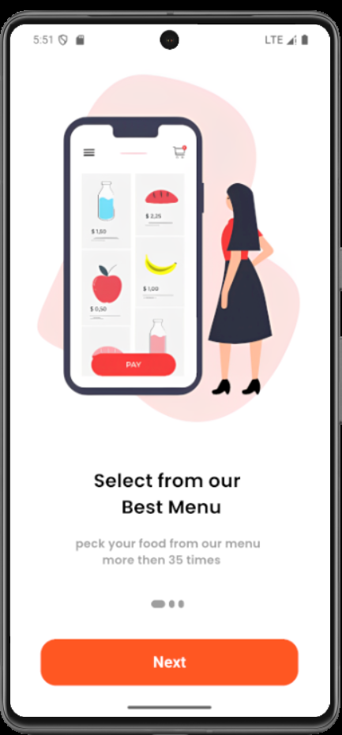
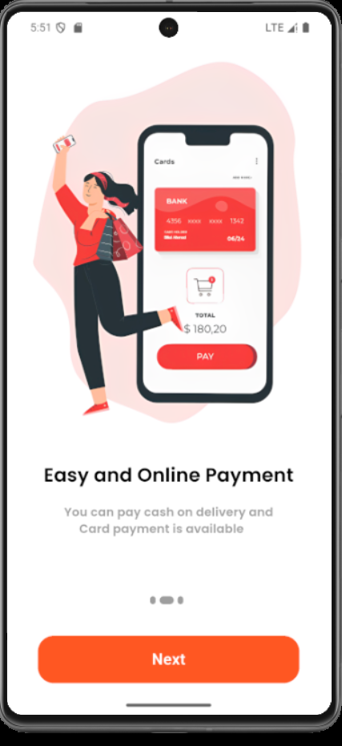
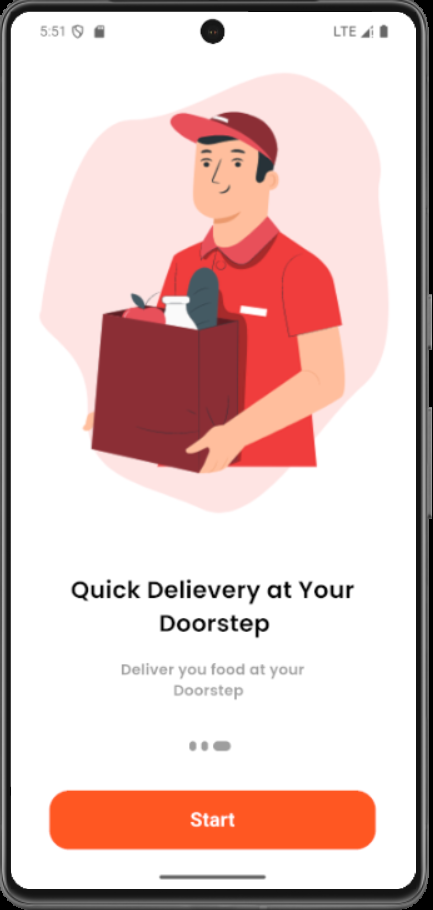
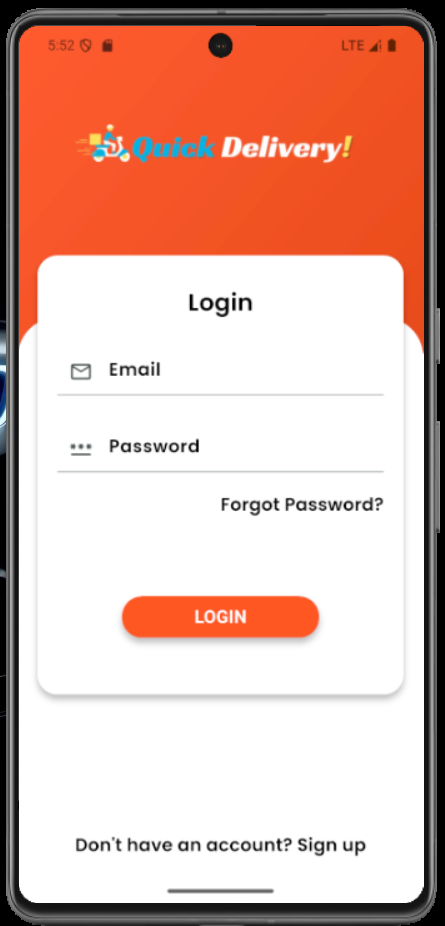
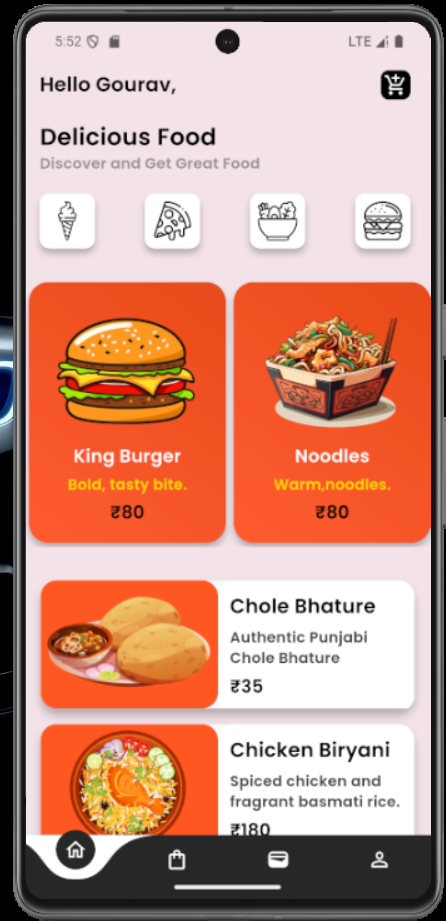
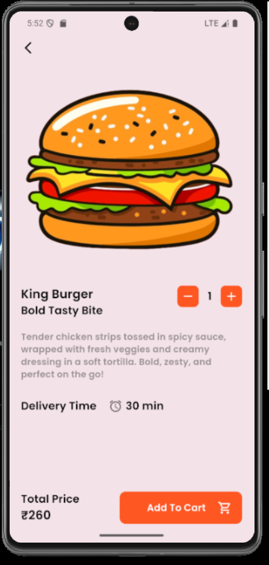
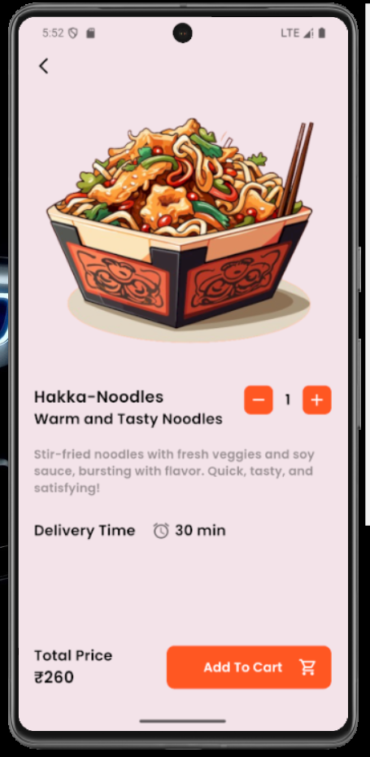
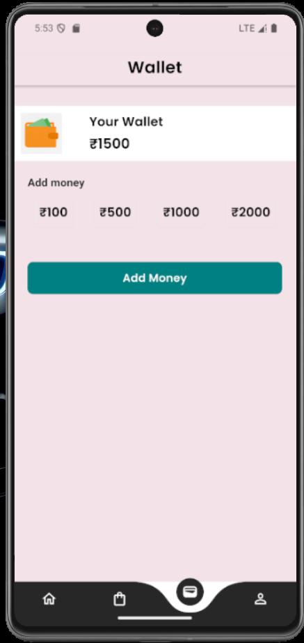
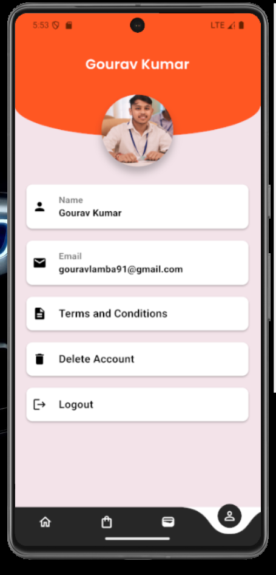

## 🍔 Food Delivery App

A modern **Flutter-based Food Delivery App** built with **BLoC architecture**, following **SOLID principles**, and focused on creating a realistic food-ordering workflow.  
This project demonstrates clean architecture, smooth state management, and beautiful UI design.

---

## 📑 Table of Contents
- [Overview](#overview)
- [Features](#features)
- [Tech Stack](#tech-stack)
- [App Workflow](#app-workflow)
- [App Architecture](#app-architecture)
- [Project Folder Structure](#project-folder-structure)
- [Error Handling](#error-handling)
- [Unit Testing](#unit-testing)
- [How to Run Locally](#how-to-run-locally)
- [Screenshots](#screenshots)
- [Future Improvements](#future-improvements)
- [Contact](#contact)

---

## 🧭 Overview
This Flutter app simulates the **food ordering process** similar to popular apps like Zomato or Swiggy.  
It focuses on **a single realistic workflow**, including:
- Browsing available restaurants and dishes
- Viewing dish details
- Adding items to the cart
- Placing an order
- Showing confirmation and order summary

---

## ✨ Features
- 🧱 **BLoC Architecture** for state management  
- 🎨 **Aesthetic UI** with modern design principles  
- ⚡ Smooth navigation and transitions  
- 🧩 **SOLID principles** followed throughout codebase  
- 🧠 **Error handling** for failed API calls or invalid user actions  
- 🧪 **Unit tests** for critical business logic and BLoC states  
- 📱 Fully responsive on Android & iOS  

---

## 🧰 Tech Stack
| Category | Tools / Libraries |
|-----------|-------------------|
| Framework | Flutter (Dart) |
| State Management | BLoC Pattern (`flutter_bloc`) |
| UI Design | Material Design, Custom Widgets |
| Testing | Flutter Test, Mockito |
| Architecture | SOLID, Clean Architecture principles |
| Version Control | Git + GitHub |

---

## 🔄 App Workflow

**1️⃣ Home Screen**  
- Displays list of restaurants or food categories.  
- User selects a restaurant.

**2️⃣ Menu Screen**  
- Displays dishes of selected restaurant.  
- Each item has name, price, and “Add to Cart” button.

**3️⃣ Cart Screen**  
- Shows added items, quantity, and total amount.  
- User can increase/decrease quantity or remove items.

**4️⃣ Order Summary / Checkout Screen**  
- Displays total order details and final confirmation.  
- User can “Place Order”.

**5️⃣ Order Confirmation Screen**  
- Shows “Order Successful” message and summary.  

All navigation and state changes are handled using **BLoC** and **Events/States**.

---
lib/
│
├── bloc/
│ ├── cart_bloc.dart
│ ├── order_bloc.dart
│ └── restaurant_bloc.dart
│
├── models/
│ ├── food_item.dart
│ ├── restaurant.dart
│
├── repositories/
│ ├── food_repository.dart
│ └── order_repository.dart
│
├── screens/
│ ├── home_screen.dart
│ ├── menu_screen.dart
│ ├── cart_screen.dart
│ ├── order_summary.dart
│
├── widgets/
│ ├── food_card.dart
│ └── custom_button.dart
│
└── main.dart


- **Single Responsibility Principle:** Each class has a single, clear purpose.  
- **Dependency Inversion:** Business logic depends on abstractions, not concrete implementations.  
- **BLoC** separates presentation and logic cleanly.

---

## ⚠️ Error Handling
- All API or repository operations wrapped with `try-catch`  
- UI shows SnackBars or AlertDialogs on errors  
- Loading and empty states handled via BLoC states:  
  - `LoadingState`, `LoadedState`, `ErrorState`, `EmptyState`

---

## 🧪 Unit Testing
Located inside `/test` directory.

**Example tests:**
- `cart_bloc_test.dart` – verifies adding/removing items  
- `order_bloc_test.dart` – tests order placement logic  
- Uses `flutter_test` and `mockito` for mocking repositories

Run tests with:
```bash
ScreenShorts
# Project Screenshots












